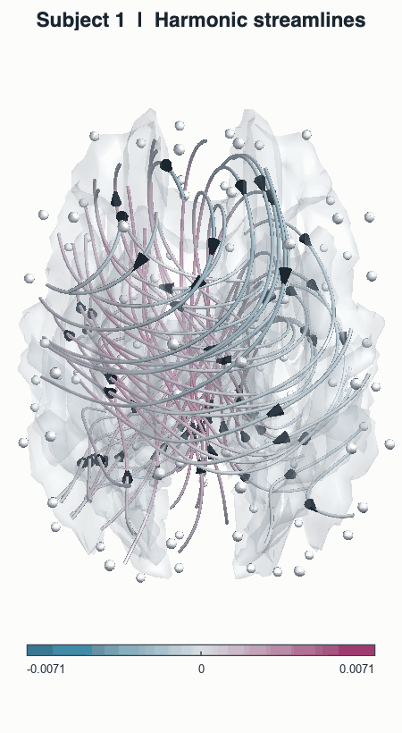
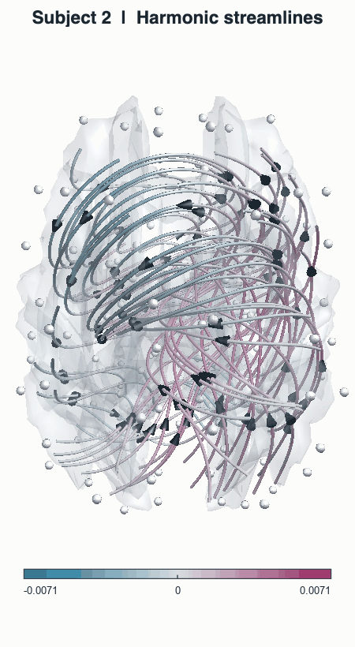
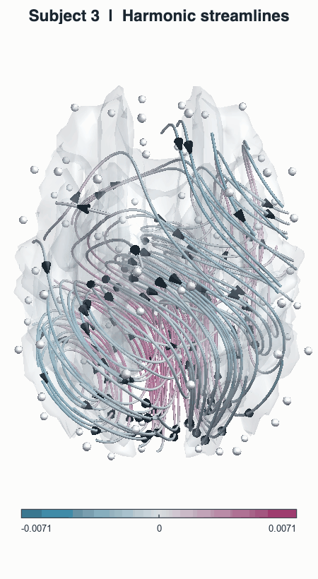

## Cyclic Network Gradients

<table>
  <tr>
    <td align="center">
       
      <b>Subject 1</b>
    </td>
    <td align="center">
       
      <b>Subject 2</b>
    </td>
    <td align="center">
       
      <b>Subject 3</b>
    </td>
  </tr>
</table>
