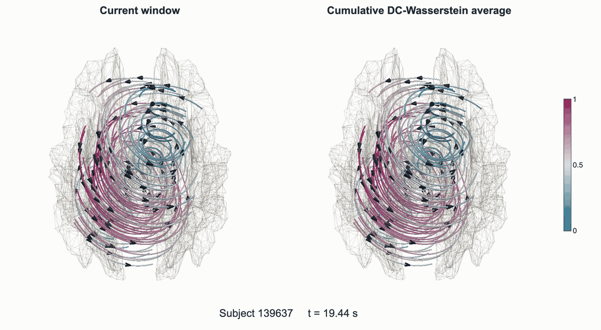
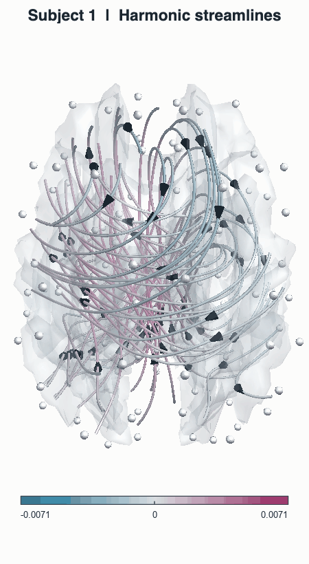
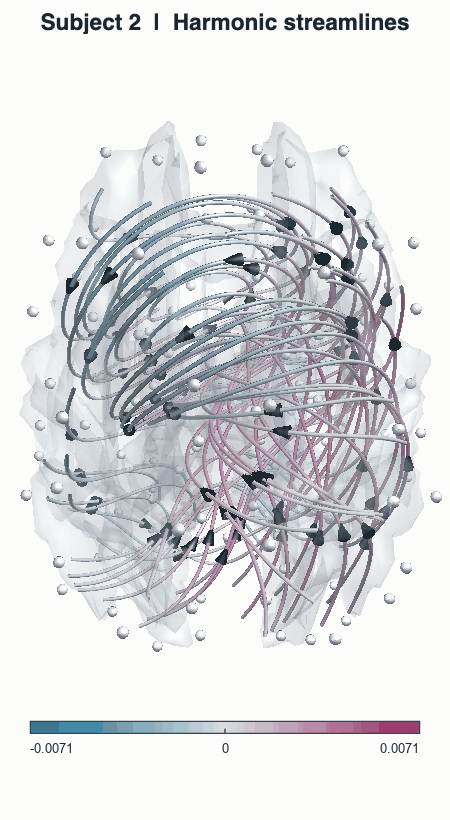
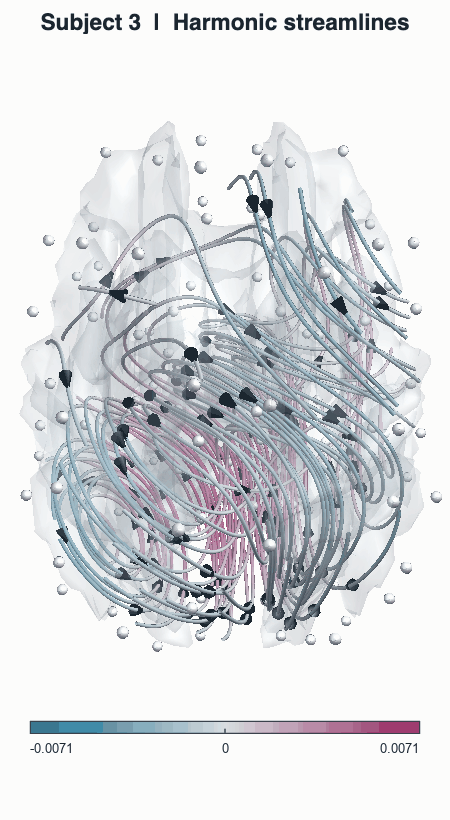

## Cyclic Network Gradients

### Time-varying cyclic flow and its cumulative DC-Wasserstein average

Subject **139637**, the first subject in Figure 2.

  

- **Left:** the projected cyclic flow from the current sliding window.
- **Right:** the cumulative DC-Wasserstein average of all window-level cycle measures available from the beginning of the recording through the displayed time. It is not an arithmetic average of edge flows or rendered images.
- **Time:** seconds since the first acquired frame. The displayed time is the end of the current window. The first complete window ends at 19.44 seconds; the last frame is at 863.28 seconds. The recording contains 1,200 frames at TR = 0.72 seconds, with 28-frame (20.16-second) windows advancing by one frame.

For the first $k$ windows, the cumulative average solves numerically

$$
\bar\mu_{1:k}\in\arg\min_{\nu}
\frac{1}{k}\sum_{i=1}^{k}W_{2,\mathbb S}^{2}(\nu,\mu_i).
$$

The animation contains 60 displayed time points. **All intervening windows are included in each cumulative fit**, not only the windows shown in the animation. Fits use the paper's sampled approximation: 32 norm-proportionally sampled cycles per window, 32 barycenter support points, three initializations, and up to 30 alternating transport/update iterations. These are numerical approximations, not certified global minimizers. For the first window alone, the barycenter is exactly the input measure. The final cumulative average reuses the saved subject average displayed in Figure 2.

The streamlines show spatially interpolated cyclic edge flows; the cumulative measure is visualized through its first moment. They are **not anatomical tracts, blood flow, or individually matched trajectories**. Both panels use the same superior view and brain outline. Color indicates relative field magnitude, normalized separately in each panel and frame; it does not compare absolute strength over time. Streamlines are clipped to the outer brain envelope. No future windows enter a cumulative fit.

### Earlier time-varying streamline animations

The original animations are retained below.

  
  
  

